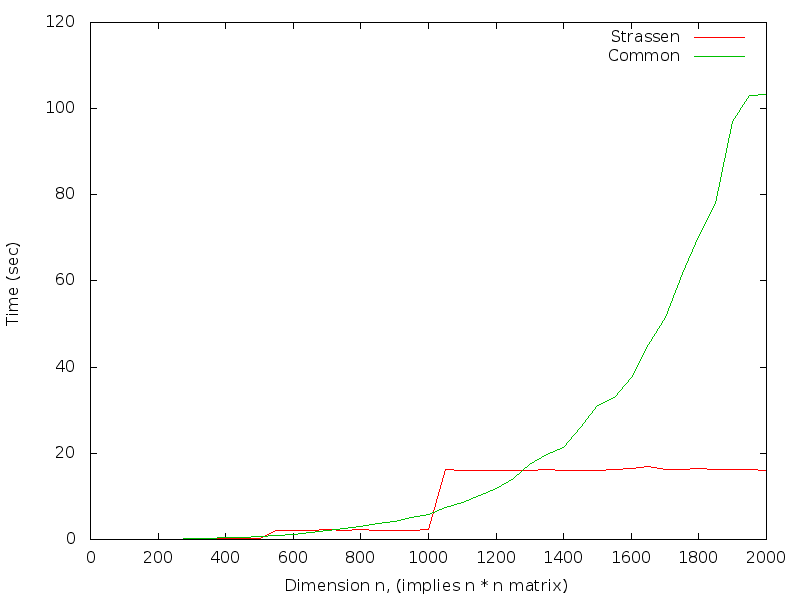

# Quick Start
- execute `make clean`; `make all` on unix/linux with gcc support.
- run `go` script using bash shell.

# Requirement
- [x] platform. workstation.
- [ ] hw simd?
- [x] data processing interface. given predefined pattern generator.
- [x] reference documtn. wiki page
- [x] anci c code.
- [x] data type. flexible to change data type.
- [x] numbers of operations, complexity.
- [x] logical errors.

# Task
- C = A + S(A, B);
    - [x] good coding style.
    - [x] well commented code.
    - [x] test vectors.
    - [x] strassen algorithm.

# Notes
- foo n ops breaks
    - n, dimension of test matrices, i.e. n-by-n.
        - the maximum dimension is 10000x10000.
    - ops, operations
        - 0, C = A + S(A, B) using strassen algorithm
        - 1, C = A + M(A, B) using common matrices multiplication.
        - 2, perform ops 0 and 1, and compare the results to verify the correctness.
        - 3, perform ops 2 and dump the result.
    - breaks,
        - the dimension of unit matrix for strassen algorithm.
        - defailt is 16, i.e. the dimension of unit matrix is 16x16.
    - patterns,
        - 0, random numbers. the range is from -46340 to 46340.
        - 1, all ones.
        - 2, sequential numbers. vector {0, 1, 2, .. , n - 1} for each row, there are totally n rows.

# Build Command
- `make`, `make all`
    - build the target `foo`
- `make dox`
    - generate doxygen documents.
- `make prof`
    - before building analysis file, run `foo` to generate a gmon.out file.
- `make clean`
    - remove all generated files.
- `go`
    - use a bash script to build and run the test automatically.
- `debug`
    - use gdb to debug the target.

# Usage
- `foo`
    - perform the verify-correctness operation with two 10-by-10 matrices.
    - the default strassen break is 16.
    - the default pattern is all-ones.
- `foo $n`
    - perform the verify-correctness operation with two $n-by$n matrices.
    - the default strassen break is 16.
    - the default pattern is all-ones.
- `foo $n $ops`
    - perform the $ops operation with two $n-by$n matrices.
    - the default strassen break is 16.
    - the default pattern is all-ones.
- `foo $n $ops $breaks`
    - perform the $ops operation with two $n-by$n matrices.
    - the strassen is $breaks.
    - the default pattern is all-ones.
- `foo $n $ops $breaks $pattern`
    - perform the $ops operation with two $n-by$n matrices.
    - the strassen is $breaks.
    - the pattern is $pattern.

# Test vectors
- performance of strassen method|
n | ops | breaks | elapsed time | result
  50|    0|   16|      0.000 sec| passed
 100|    0|   16|      0.000 sec| passed
 150|    0|   16|      0.040 sec| passed
 200|    0|   16|      0.040 sec| passed
 250|    0|   16|      0.040 sec| passed
 300|    0|   16|      0.300 sec| passed
 350|    0|   16|      0.300 sec| passed
 400|    0|   16|      0.300 sec| passed
 450|    0|   16|      0.300 sec| passed
 500|    0|   16|      0.300 sec| passed
 550|    0|   16|      2.200 sec| passed
 600|    0|   16|      2.200 sec| passed
 650|    0|   16|      2.190 sec| passed
 700|    0|   16|      2.210 sec| passed
 750|    0|   16|      2.200 sec| passed
 800|    0|   16|      2.210 sec| passed
 850|    0|   16|      2.190 sec| passed
 900|    0|   16|      2.190 sec| passed
 950|    0|   16|      2.200 sec| passed
1000|    0|   16|      2.210 sec| passed
1050|    0|   16|     16.160 sec| passed
1100|    0|   16|     16.110 sec| passed
1150|    0|   16|     16.130 sec| passed
1200|    0|   16|     16.130 sec| passed
1250|    0|   16|     16.130 sec| passed
1300|    0|   16|     16.110 sec| passed
1350|    0|   16|     16.150 sec| passed
1400|    0|   16|     16.110 sec| passed
1450|    0|   16|     16.130 sec| passed
1500|    0|   16|     16.130 sec| passed
1550|    0|   16|     16.150 sec| passed
1600|    0|   16|     16.440 sec| passed
1650|    0|   16|     16.830 sec| passed
1700|    0|   16|     16.200 sec| passed
1750|    0|   16|     16.250 sec| passed
1800|    0|   16|     16.450 sec| passed
1850|    0|   16|     16.200 sec| passed
1900|    0|   16|     16.190 sec| passed
1950|    0|   16|     16.270 sec| passed
2000|    0|   16|     16.100 sec| passed
- performance of common method,
- verification of correctness,

# dimension vs time

